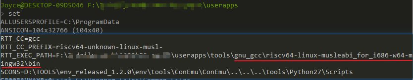
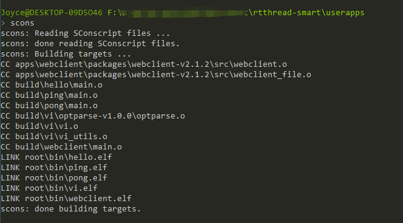
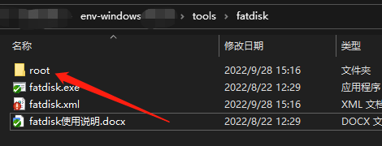
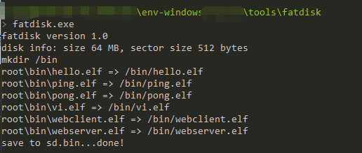
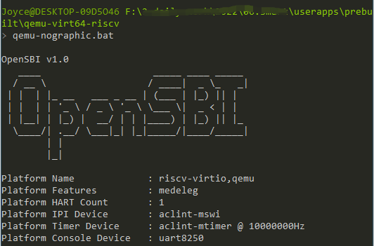
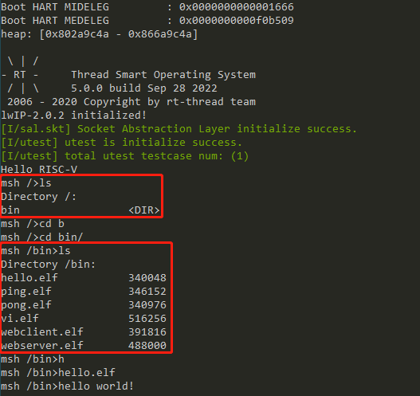
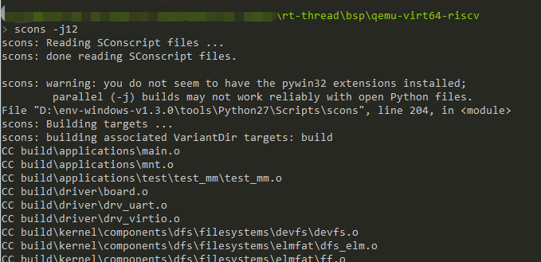

# RT-Smart 用户态应用开发SDK

## 如何构建用户态应用

### 下载代码

下载smart 用户态应用代码：

```
git clone https://github.com/RT-Thread/userapps.git
```

源码目录说明：

```
.
├── apps                  ---- app体验示例
├── configs               ---- 不同平台app的通用配置
├── linker_scripts        ---- 编译app使用的链接脚本
├── prebuilt              ---- 预编译好的内核镜像
├── rtconfig.h            ---- app使用的公共配置文件
├── sdk                   ---- 开发app使用的sdk
├── smart-env.bat         ---- 配置Win上环境变量的脚本
├── smart-env.sh          ---- 配置Linux上环境变量的脚本
└── tools                 ---- 开发app使用的脚本工具
     ├── get_toolchain.py ---- 下载工具链的脚本
     └── gnu_gcc          ---- 下载下来的工具链存放的路径
```

### 配置工具链

在userapps\tools目录下运行get_toolchain.py的脚本，会下载对应的工具链并展开到userapps\tools\gun_gcc目录。后面的工具链名称可以是 arm | riscv64。

本文以RISC-V平台为例，输入下面的命令：

```
python get_toolchain.py riscv64
```

在userapps目录下,运行smart-env.bat配置工具链路径，目前支持的参数可以是 arm | riscv64

```
smart-env.bat riscv64
```

可使用set命令检查RTT_EXEC_PATH是否设置成功



### 编译用户态应用

在rtthread-smart\userapps目录下使用scons编译，编译顺利的话，将在root文件夹中得到一系列可执行elf文件。



## 运行用户态应用

在本仓库的 prebuilt 目录下存放有预构建好的针对 QEMU RISC-V 平台的内核镜像 qemu-virt64-riscv\rtthread.bin，可以直接运行体验。

### 更新QEMU

由于 Env 自带的 QEMU 版本过低，因此需要更新 QEMU（Env更新QEMU后可删除本步骤）

1. 下载安装 QEMU（推荐qemu-w32-setup-20220831.exe ）：https://qemu.weilnetz.de/w32/
2. 将 Env 里的 QEMU 替换为新版本。

### 制作QEMU SD卡

在 Env 工具的 tools\fatdisk 目录下有一个打包 FAT 格式文件的工具 fatdisk.exe，我们可以利用这个工具将我们要存储到QEMU SD卡里的文件打包成 sd.bin 文件。

1. 将userapps下的root目录复制到env\tools\fatdisk目录下



2. 修改 env\tools\fatdisk 目录下 fatdisk.xml 文件为下面的内容

```
<?xml version="1.0" encoding="UTF-8"?>
<fatdisk>
   <disk_size>65536</disk_size>
   <sector_size>512</sector_size>
   <root_dir>root</root_dir>
   <output>sd.bin</output>
   <strip>0</strip>
</fatdisk>
```

3. 在 env\tools\fatdisk 目录下右键打开 Env 工具，输入命令 fatdisk运行，就会在当前目录下生成 sd.bin 文件了。



4. 将新生成的 sd.bin 放入userapps\prebuilt\qemu-virt64-riscv目录。

### 运行QEMU

在userapps\prebuilt\qemu-virt64-riscv目录下打开Env，执行qemu-norgraphic.bat运行QEMU。



Smart运行起来后输入 ls 可以看到我们存储到 QEMU SD 卡里的文件和文件夹了。



在最后执行了hello示例，输出"hello world!"。

执行ctrl c可退出QEMU。

## 构建内核镜像

当需要更新内核镜像文件时，查看本节内容。

下载rt-thread源码（如有则跳过），之后切换到rt-smart分支并从远端同步更新。

```
git clone https://github.com/RT-Thread/rt-thread.git

git checkout rt-smart
# update kernel's rt-smart branch to the latest version
git pull origin rt-smart
```

基于rt-thread仓库rt-smart分支的 qemu-virt64-riscv BSP构建内核镜像。




将生成的内核镜像rtthread.bin更新到userapps\prebuilt\qemu-virt64-riscv目录即可。

## QA

### scons时找不到工具链

编译时出现如下信息：

```
> scons
scons: Reading SConscript files ...
scons: done reading SConscript files.
scons: Building targets ...
CC apps\webclient\packages\webclient-v2.1.2\src\webclient.o
Error in calling command:riscv64-unknown-linux-musl-gcc
Exception: No such file or directory

Please check Toolchains PATH setting.

scons: *** [apps\webclient\packages\webclient-v2.1.2\src\webclient.o] Error 2
scons: building terminated because of errors.
```

请检查工具链路径是否设置正确，按照文中步骤进行设置。

### scons时出现zlib1.dll丢失的弹窗

重新下载[zlib1.dll文件](https://www.dlldownloader.com/zlib1-dll/)并分别放在C:\Windows\System32与C:\Windows\SysWOW64文件夹中。