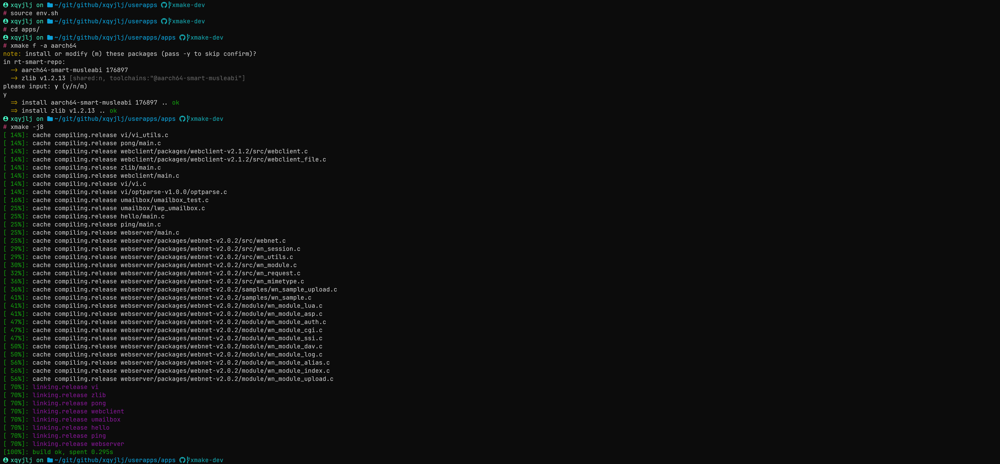
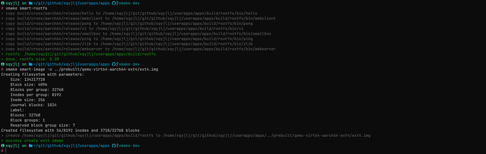

# 介绍与快速入门

> 本文档环境为 `ubuntu 20.04`

## 介绍

### RT-Thread-Smart

RT-Thread Smart（以下简称 Smart） 是基于 RT-Thread 操作系统上的混合操作系统，简称为 rt-smart，它把应用从内核中独立出来，形成独立的用户态应用程序，并具备独立的地址空间（32 位系统上是 4G 的独立地址空间）。详细信息请见 [RT-Thread 文档中心](https://www.rt-thread.org/document/site/#/rt-thread-version/rt-thread-smart/introduction/rt-smart-intro/rt-smart-intro)

### Xmake

xmake 是一个基于 Lua 的轻量级跨平台构建工具，使用 xmake.lua 维护项目构建，相比 makefile/CMakeLists.txt，配置语法更加简洁直观，对新手非常友好，短时间内就能快速入门，能够让用户把更多的精力集中在实际的项目开发上。详细信息请见 [Xmake 文档中心](https://xmake.io/#/zh-cn/about/introduction)

## 快速入门

> 此次以 qemu-virt64-aarch64 为例讲解

1. **安装 xmake**

   请根据 [xmake 官方文档](https://xmake.io/#/zh-cn/guide/installation?id=ubuntu) 进行安装。

   以下为 ubuntu 安装方式

   ```shell
   sudo add-apt-repository ppa:xmake-io/xmake
   sudo apt update
   sudo apt install xmake
   ```

2. **克隆仓库**

   将 Smart 的 userapps 仓库克隆下来, 假定我们的工作路径是 `$WS`：

   ```shell
   cd $WS
   git clone https://github.com/RT-Thread/userapps.git
   ```

3. **编译用户态应用程序**

   文件系统由多个应用程序组成，这些应用程序都放在 `apps` 目录下。由于 smart 采用 xmake 编译用户态环境，因此 smart 的编译方式非常简单。

   首先进入 userapps 并运行 `env.sh` 添加一下环境变量。

   ```shell
   cd $WS/userapps
   source ./env.sh
   ```

   进入 apps 目录进行编译

   ```shell
   cd apps
   xmake f -a aarch64 # 配置为 aarch64平台，如果不执行该条指令进行配置，则默认为 aarch64
   xmake -j$(nproc)
   ```

   目前支持的平台：arm、aarch64、riscv64gc。

   


4. **制作文件系统**

   运行 `xmake smart-rootfs` 制作 rootfs，所谓制作文件系统，就是将上一步编译生成的用户程序按照文件系统的布局拷贝到 `$WS/userapps/apps/build/rootfs` 路径下。

   ```shell
   xmake smart-rootfs
   ```

5. **制作镜像**

   运行 `xmake smart-image` 制作镜像，将上一步制作的 `$WS/userapps/apps/build/rootfs` 目录下的文件系统打包生成特定格式的 image 文件。

   ```shell
   xmake smart-image -f ext4 #制作 ext4 镜像
   ```

   目前支持的镜像格式包括 ext4/fat/cromfs。

   这里的例子会在 `$WS/userapps/apps/build` 路径下生成 `ext4.img` 文件。

   

## prebuilt 的版本

会在每天凌晨生成 aarch64/riscv64 for qemu 的 prebuilt 版本，包括内核和 rootfs 文件系统：

- [aarch64](https://download-redirect.rt-thread.org/download/rt-smart/prebuilt/qemu-virt64-aarch64_latest.tar.gz)
- [riscv64](https://download-redirect.rt-thread.org/download/rt-smart/prebuilt/qemu-virt64-riscv_latest.tar.gz)

可以使用 qemu 来运行起来。
