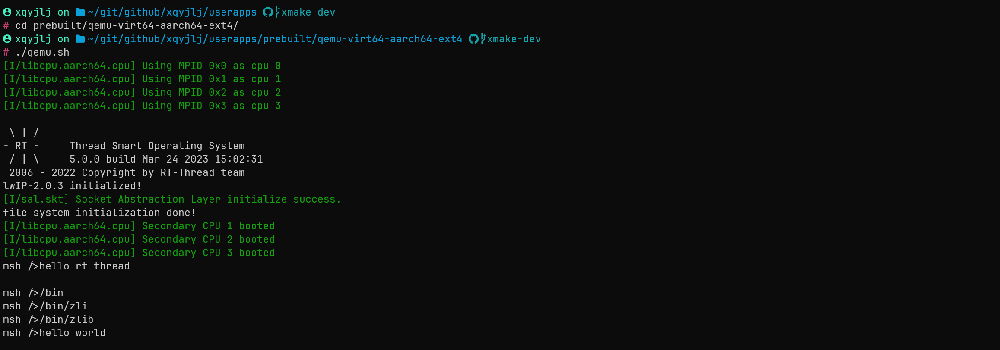

# 介绍与快速入门

> 本文档环境为 `ubuntu 20.04`
>
> 更多文档请前往 https://club.rt-thread.org/ask/article/1c95a3e1c58c0c25.html

## 介绍

### RT-Thread-Smart

RT-Thread Smart（以下简称 Smart） 是基于 RT-Thread 操作系统上的混合操作系统，简称为 rt-smart，它把应用从内核中独立出来，形成独立的用户态应用程序，并具备独立的地址空间（32 位系统上是 4G 的独立地址空间）。详细信息请见 [RT-Thread 文档中心](https://www.rt-thread.org/document/site/#/rt-thread-version/rt-thread-smart/introduction/rt-smart-intro/rt-smart-intro)

### Xmake

xmake 是一个基于 Lua 的轻量级跨平台构建工具，使用 xmake.lua 维护项目构建，相比 makefile/CMakeLists.txt，配置语法更加简洁直观，对新手非常友好，短时间内就能快速入门，能够让用户把更多的精力集中在实际的项目开发上。详细信息请见 [Xmake 文档中心](https://xmake.io/#/zh-cn/about/introduction)

## 快速入门

> 此次以 qemu-virt64-aarch64 为例讲解

1. **克隆仓库**

   将 Smart 的 userapps 仓库克隆下来：

   ```shell
   git clone https://github.com/RT-Thread/userapps.git
   ```

2. **安装 xmake**

   请根据[xmake 官方文档](https://xmake.io/#/zh-cn/guide/installation?id=ubuntu)进行安装

   以下为 ubuntu 安装方式

   ```shell
   sudo add-apt-repository ppa:xmake-io/xmake
   sudo apt update
   sudo apt install xmake
   ```

3. **安装 qemu**

   userapps 已提供 qemu 7.1.0 的安装包，请自行下载 https://download_redirect.rt-thread.org/download/rt-smart/native/tools/qemu/qemu_7.1.0-2022111713_amd64.deb

   ```shell
   sudo apt-get install -y libglib2.0-dev libpixman-1-dev
   curl -L https://download_redirect.rt-thread.org/download/rt-smart/native/tools/qemu/qemu_7.1.0-2022111713_amd64.deb -o ./qemu.deb
   sudo dpkg -i ./qemu.deb
   ```

   如若想安装最新版本，请自行下载 qemu 源码进行编译安装

4. **编译**

   由于 smart 采用 xmake 编译用户态环境，因此 smart 的编译方式非常简单。

   首先运行 env.sh 添加一下环境变量

   ```shell
   source env.sh
   ```

   进入 apps 目录进行编译

   ```shell
   cd apps
   xmake f -a aarch64 # 配置为 aarch64平台
   xmake -j8
   ```

   

5. **镜像制作**

   运行 `xmake smart-rootfs` 制作 rootfs ，运行 `xmake smart-image` 制作镜像

   ```shell
   xmake smart-rootfs
   xmake smart-image -o ../prebuilt/qemu-virt64-aarch64/ext4.img # 将镜像输出至 qemu-virt64-aarch64 目录
   ```

   

6. **运行 qemu**

   进入 `userapp/prebuilt/qemu-virt64-aarch64`，运行 qemu.sh 脚本启动 qemu

   ```shell
   cd prebuilt/qemu-virt64-aarch64/
   ./run.sh
   ```

   

   在 qemu 中 输入 `ctrl+a` 抬起后，再输入 `x` 即可退出 qemu

## prebuilt 的版本

会在每天凌晨生成 aarch64/riscv64 for qemu 的 prebuilt 版本，包括内核和 rootfs 文件系统：

- [aarch64](http://117.143.63.254:9012/www/rt-smart/prebuilt/qemu-virt64-aarch64_latest.tar.gz)
- [riscv64](http://117.143.63.254:9012/www/rt-smart/prebuilt/qemu-virt64-riscv_latest.tar.gz)

可以使用 qemu 来运行起来。
